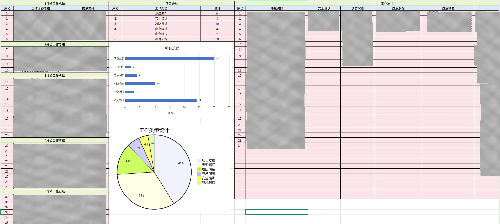

# 安服提升计划与工作总结文档

本仓库包含了个人安全服务(安服)工作总结报告模板，旨在帮助安服团队分阶段总结工作学习提升。

## 前言

随着2024年的落幕，迎来了撰写年终总结的时刻，值此岁末之际，我们回顾并总结过去一年的项目成果。

## 项目说明

我设计的这套模板主要包含以下几个部分：
- 📝 **日报模板**：记录每日工作内容、问题及解决方案
- 📊 **周报模板**：总结每周重点工作，规划下周任务
- 📈 **月报模板**：月度工作回顾与数据分析
- 📑 **年终总结**：年度工作成果与个人成长总结

### 去年模板

| 介绍                 | 预览图           |
| -------------------- | :--------------- |
| **24年工作项目统计** |  |

### 最新模板

| 日报                | 周报                | 月报                | 年度总结                |
| ------------------- | ------------------- | ------------------- | ----------------------- |
|  |  |  |  |

## 作业

- 📊 数据可视化展示
- 🔍 清晰的工作学习进度追踪
- 📈 项目完成度统计
- 🎯 目标达成分析
- 💡 经验总结与改进建议

## 更新日志

- 2024-12-31: 首次发布，优化了日报和年报模板

## 贡献指南

欢迎提交Issue和Pull Request来帮助改进这个项目。

